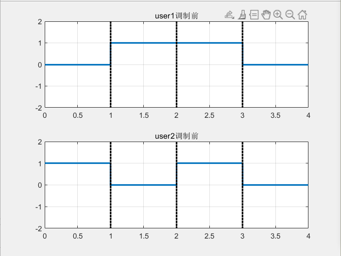
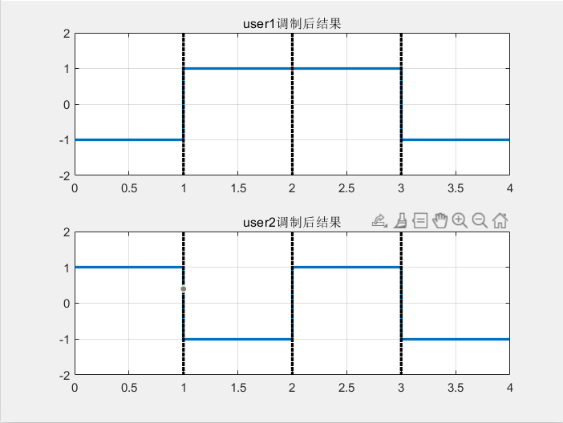
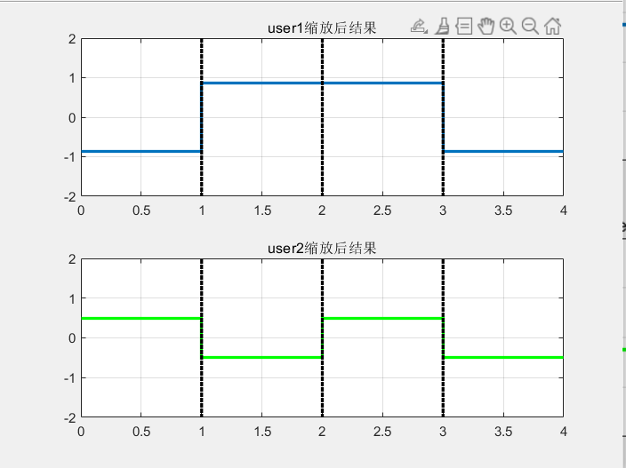
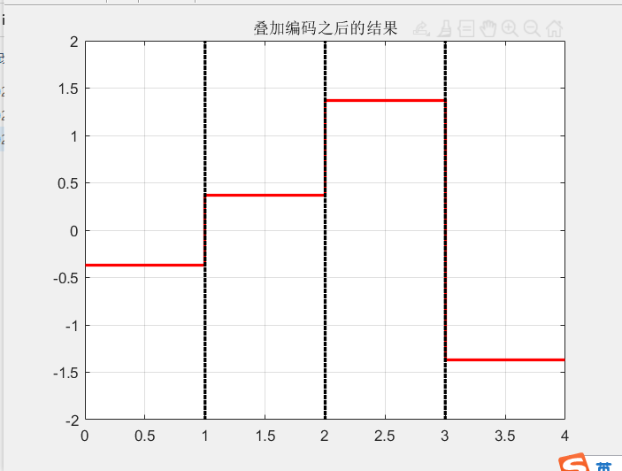

NOMA(Non Orthogonal Multiple Access )是一项5G的多址接入方案的候选技术，与传统的通信方案的一个很大区别就是，可以在同一个时间用同一段频段传递多个用户的信息。

用$x_1$代表用户1传递的消息，用$x_2$代表用户2需要传递的消息，这里的调制方式为了简单，我们选取BPSK做为调制方式，也就是0映射为-1，1映射为1。假设user1发送的消息为{0 0 1 0}，user2发送的消息为{1 0 1 0}。

需要发送的信息为：

则经过调制后，二者的波形如下图所示：

想要一起发送，最简单的方式就是将调制后两者结果直接相加，但是假如结果为0，并不知道那个用户是1，哪个是-1，无法区分用户，而且如果直接相加，其实没有完全考虑用户，如果某一个用户离得远，需要对其加大功率保证他接收到完整的信号，直接相加，二者的功率是一样的。

解决办法：**先进行缩放，在将二者进行相加。**

图中画出来的是幅度，$幅度^2=功率$，一般来说，发射机能发射的功率是有限的，假设发射机的功率为1，其中0.75的功率给user1，剩余0.25的功率分配给user2，也就是$a_1=0.75,a_2=0.25$,则user1和user2的幅度分别为，$\sqrt{a1}$和$\sqrt{a2}$

缩放后的结果为：

最终发送结果：$x_1\times\sqrt{a1}+x_2\times\sqrt{a2}$

二者相加，即可得到要发送的信息，要发送的信息为：

为了方便理解，举两个例子：

user1 发 0 user2 发 1

则最终发送的为：$-1\times\sqrt{a1}+1\times\sqrt{a2}=-1\times\sqrt{0.75}+1\times\sqrt{0.25}=-0.366$

user1 发 1 user2 发 0

则最终发送的为：$1\times\sqrt{a1}+-1\times\sqrt{a2}=1\times\sqrt{0.75}+-1\times\sqrt{0.25}=0.366$

相关代码下载：xxxx

那么在接收端，要如何恢复user1和user2的信号呢？参见：xxx